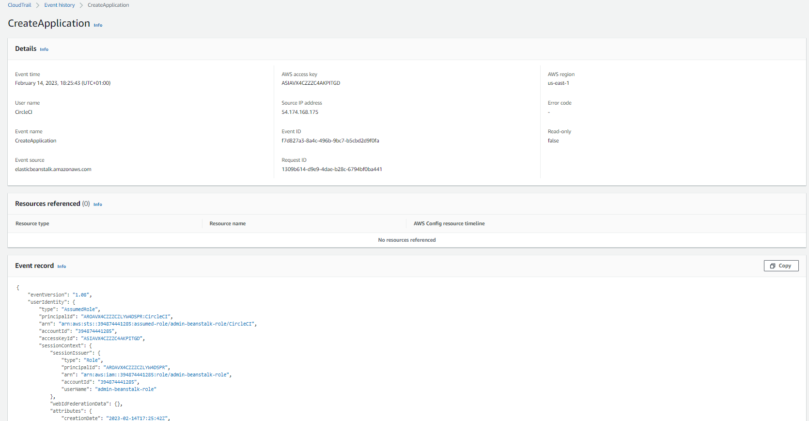

# A quick how to assume AWS Role for CircleCi pipeline/deployments


</br>
 AWS Role Assume is a more secure method for granting temporary access to AWS resources. When a user assumes an AWS role, they receive temporary security credentials that are valid for a limited time, and those credentials are automatically rotated by AWS.</br>
 This approach is particularly useful in situations where you need to grant access to AWS resources to a third-party ,in our case CircleCI.
 So, going with Role Assume  is the more secure option, as it reduces the risk of credentials being leaked or stolen.
</br>
 On this repo, you'll find a short demo in how to go through setting up a CircleCi config ,along with  IAM user + Role assumption between different AWS Accounts, the same scenario can be used if you are using AWS organization/SSO , or you have only one AWS account.
</br></br>
Suppose we have two accounts, one `Master/root/mgmt` and the other named `2nd_account`. We also have an IAM user named `deploy-user` in Master account, and an IAM role named `admin-beanstalk-role` in `2nd_account` account. In this scenario, deploy-user will assume the IAM role that's named `admin-beanstalk-role` in another account.to  use the AssumeRole API call with multiple accounts or cross-accounts, we must have a trust policy to grant permission to assume roles similar to the following:
</br></br>
Make sure you have an IAM user created named `deploy-user` which have only below policy appled, also make sure you have saved its programmatic keys.
Policy permissions required for `deploy-user` in Master account:

```
{
  "Version": "2012-10-17",
  "Statement": [
    {
      "Effect": "Allow",
      "Action": "sts:AssumeRole",
      "Resource": "arn:aws:iam::2nd_account_id:role/admin-beanstalk-role"
    }
  ]
}
```

</br>
And here's the example of the trust policy for `admin-beanstalk-role`:

```
{
  "Version": "2012-10-17",
  "Statement": [
    {
      "Effect": "Allow",
      "Principal": {
        "AWS": "arn:aws:iam::master_account_Id:user/deploy-user"
      },
      "Action": "sts:AssumeRole"
    }
  ]
}
```
</br></br>
Please go to CircleCi and under your project settings and add 3 Environment variables as below:
</br>   AWS_ACCESS_KEY_ID
</br>   AWS_SECRET_ACCESS_KEY
</br>   AWS_REGION
</br>These variables are values of Master account IAM user: `deploy-user`
</br>

All other config of CircleCI is set under path  `.circleci/config.yml` , runnig this pipeline ,you are supposed to created an empty Application under AWS Elastic Beanstalk named: `My-first-app`
</br>

</br> Once you've a succesfully pipeline run and a new Beanstalk application created, got to `2nd_account` AWS Cloudtrail and verify what user/role did create your resouces, se below my example. </br>
You can see how nonexisting IAM Username appeared : `CircleCI` , with temporary AWS Access keys, and also the role arn: `"arn:aws:iam::394874441285:role/admin-beanstalk-role`" , this keys will be valid for 15 minutes in our case:</br></br>
